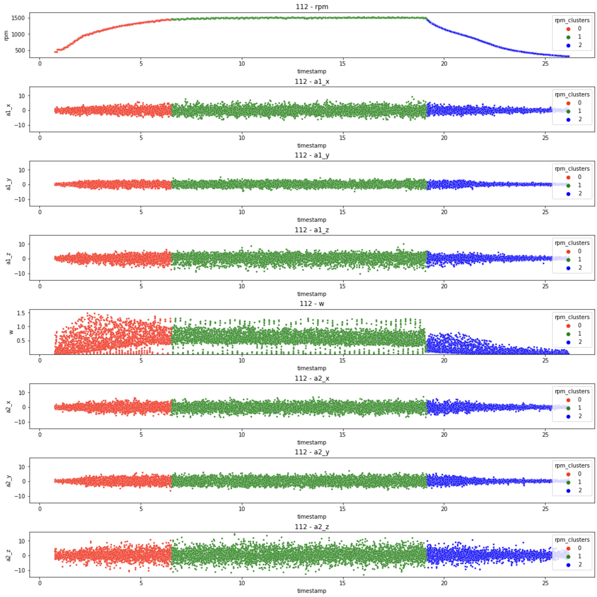
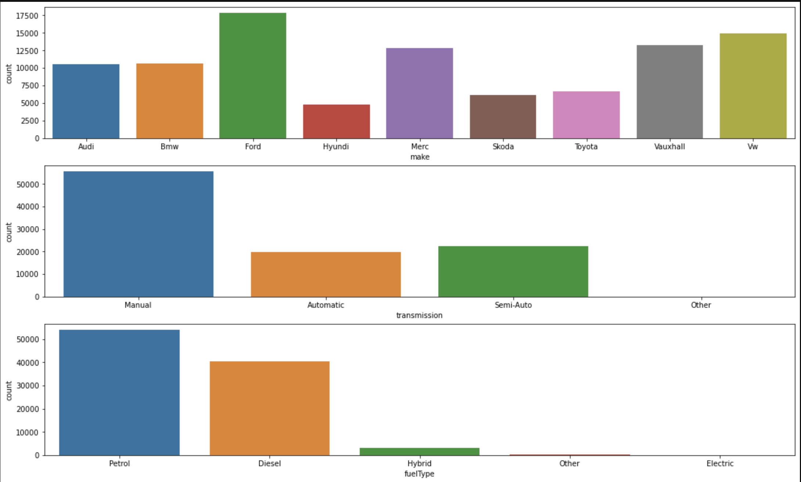

# Data Science Projects
This repository hosts all my public Data Science Projects:

1. [Mechanical Bearing Classification](https://github.com/WaldemarWalo/DataScienceProjects/tree/main/Mechanical_Bearing_Classification)
- Unbalanced, binary classification of mechanical bearing based on features from accelerometer data and DC motor. Dataset with 10 million records and 14 features
- Feature engineering with clustering, grouping data by experiment and extracting distribution properties: sum, mean, median, skew, kurtosis, iqr and others
- Achieved roc_auc score of 0.9959 with an AdaBoost and RepeatStratifiedKfold. Clustered created features with GausianMixture to achieve an Adjusted RAND score of 0.76

2. [UK Used Cars Price Prediction](https://github.com/WaldemarWalo/DataScienceProjects/tree/main/UK_Used_Cars_Price_Prediction)
- Price prediction for selected model and make from a dataset of used cars for 8 makes and 196 car models. The full dataset contains 100k car listings and 9 features.
- Trained Linear Regression, Lasso and Ridge with Polynomial Features selected with SelectKBest produced an R2 score of 0.873. Achieved the best R2 score of 0.885 with CatBoostRegressor

3. [Toolkit](https://github.com/WaldemarWalo/DataScienceProjects/tree/main/Toolkit) - small library with small reusable functions that I found missing in available frameworks

You can connect with me on 
[LinkedIn](https://www.linkedin.com/in/waldemar-walo/) or find me on [Kaggle](https://www.kaggle.com/waldemar)